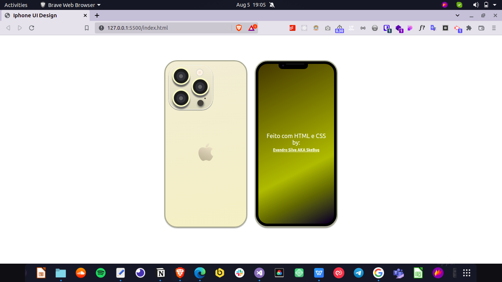

  

  

  
    
   

   

<h1 align="center" style="font-weight: bold"> 📚 iPhone 13 Pro Max UI Design feito com HTML e CSS 📚</h1>
<h1 align="center">
    
</h1>

<h4 align="center"> 
	🚧 Concluído 🚧
</h4>

<h3 align="center"> <a href="#">Acessar o projecto</a> </h3>

---
## Índice:
<!--ts-->
   * [Sobre](#-sobre-o-projeto)
   * [Tecnologias](#-tecnologias)
   * [Autor](#-autor)
   * [Licença](#-licença)
   * [Versões do ReadMe](#-versões-do-readme)
        * [Português](./README-pt.md)
        * [Inglês](./README.md)
<!--/ts-->
<!--te-->
---
## 💻 Sobre o projeto

  Projecto feito por diversão em um momento de tédio LOL!!!

---
## 🛠 Tecnologias

As seguintes ferramentas foram usadas na construção do projecto:

<li><a href="https://www.w3schools.com/html/">HTML</a></li>
<li><a href="https://www.w3schools.com/css/">CSS</a></li>

---

## 🦸 Autor

<a href="https://github.com/EvandroSilvaProgrammer">
 
  
 <b>Evandro Silva AKA SkeBug</b></a> <a href="https://github.com/EvandroSilvaProgrammer" title="EvandroSilva">🇦🇴</a>
    

 

---

## 📝 Licença

Este projeto esta sobe a licença [MIT](./LICENSE).

Feito com ❤️ por Evandro Silva AKA SkeBug 👋🏽 [Entre em contato!](https://www.linkedin.com/in/evandrosilva-programmer/)

---

##  Versões do README

[Português 🇦🇴](./README-pt.md)  |  [Inglês 🇺🇸](./README.md) 
